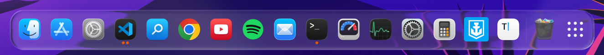
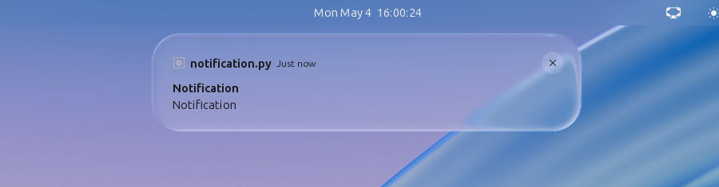
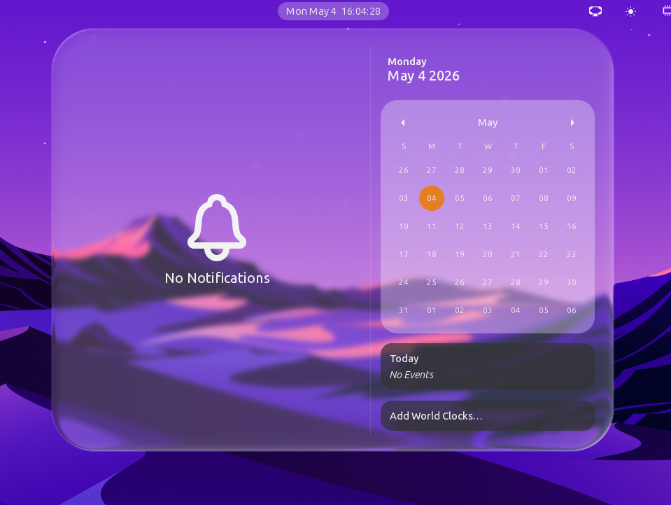
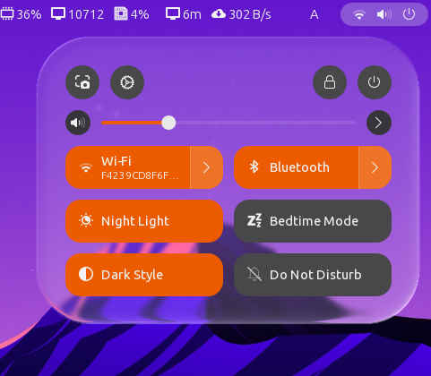
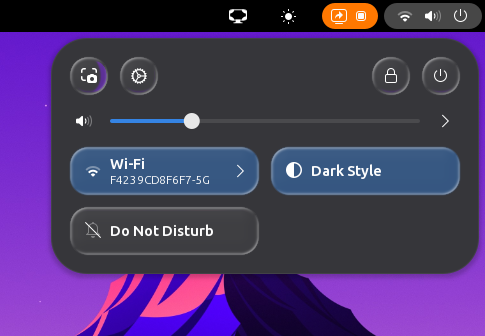
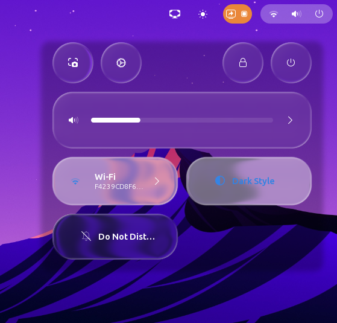
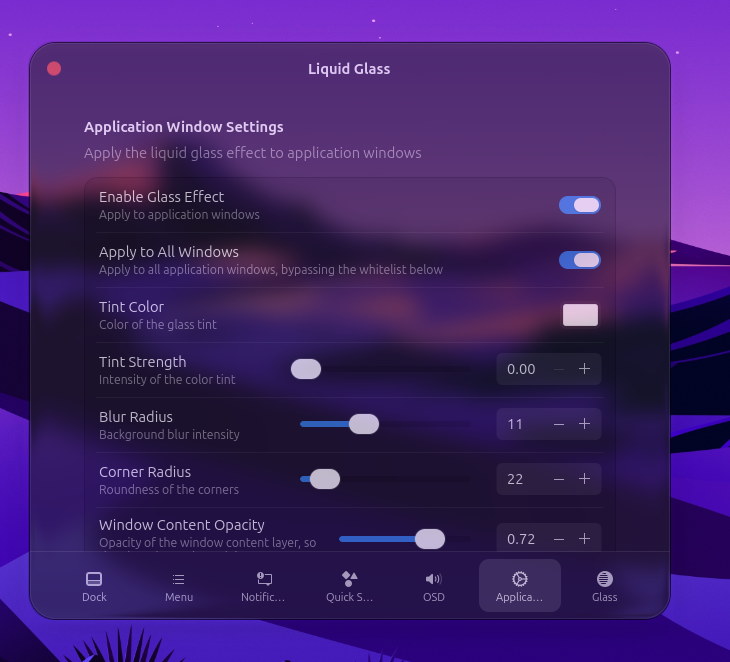
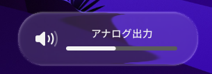
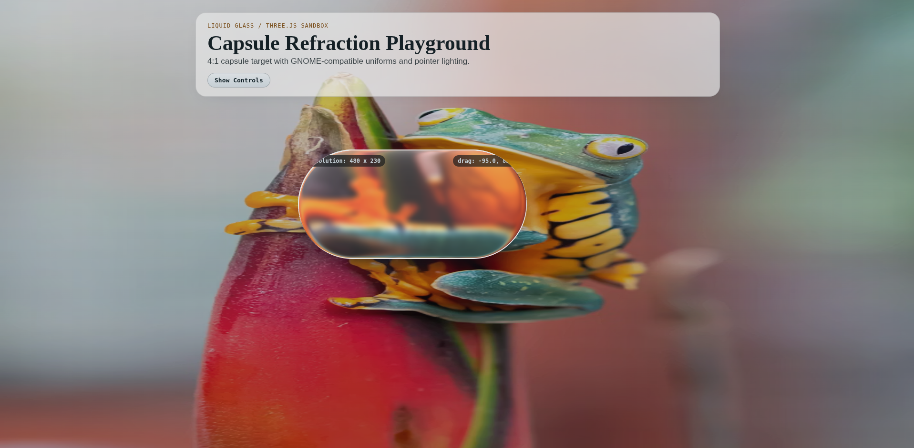

# Liquid Glass for GNOME Shell


A GNOME Shell Extension that replicates the "Liquid Glass" UI concept using shaders on your desktop.

> [!NOTE]
> **Disclaimer:** This is an unofficial, community-driven fan project and is not affiliated with, endorsed by, or connected to Apple Inc. in any way.

I love the look of Apple's Liquid Glass, but since I don't own any Apple products (I use an Android smartphone and a Linux computer), I wanted a way to see it on my desktop every day. So, I decided to build it myself.

## Demo

Dash to Dock:



Notifications:



Panel Menus:



Quick Settings (Background mode):



Quick Settings (Toggle mode, Adwaita theme):



Quick Settings (Toggle mode, MacTahoe theme):



> The screenshot above uses the [MacTahoe GTK theme](https://github.com/vinceliuice/MacTahoe-gtk-theme) by vinceliuice. The theme is not bundled with this extension and has to be installed separately.

Application Windows:



OSD:




## Installation (GNOME Extension)

> [!IMPORTANT]
> This extension is **not yet available on [extensions.gnome.org](https://extensions.gnome.org)**. It has been submitted, but is still unreviewed, so for now it has to be installed manually using one of the methods below.

### Option 1: Quick Install (Terminal)
Copy and paste this one-liner to clone and install it immediately:

```bash
git clone https://github.com/ryohsuke1231/liquid-glass.git && \
mkdir -p ~/.local/share/gnome-shell/extensions/ && \
cp -r liquid-glass/liquid-glass@thinkingcoding1231.gmail.com ~/.local/share/gnome-shell/extensions/
```

### Option 2: Manual Install
1. Clone this repository: `git clone https://github.com/ryohsuke1231/liquid-glass.git`
2. Open the `liquid-glass` folder.
3. Copy the **entire `liquid-glass@thinkingcoding1231.gmail.com` folder** to:
   `~/.local/share/gnome-shell/extensions/`
4. **Restart GNOME Shell**:
   - **Wayland**: Log out and log back in.
   - **X11**: Press `Alt` + `F2`, type `r`, and hit `Enter`.
5. Enable **Liquid Glass** in the "Extensions" app or Extension Manager.


## What Can Be Made of Glass

The effect can be enabled or disabled per UI element, and each element has its own page in the preferences window. Every element shares the same core controls (tint color and strength, blur radius, corner radius, glass expand, offsets, and brightness / contrast / saturation under "Advanced"), plus the element-specific features listed below.

| Element | Notes / Special features |
| --- | --- |
| **Dash to Dock** | Glass behind the dock. Adds a bottom margin control so the dock can float above the screen edge. Works with the Dash to Dock / Ubuntu Dock extension. |
| **Panel Menus** | Glass behind top panel menus and popups. Adds **custom spring animation** (stiffness / damping / mass) for opening and closing, and **adaptive text coloring**. |
| **Notifications** | Glass behind notification banners. Supports **adaptive text coloring** and a hide safety margin to avoid flicker while the banner is dismissed. |
| **Quick Settings** | Two modes: **Background mode** applies one sheet of glass behind the whole panel, and **Toggle mode** turns every individual toggle button into its own piece of glass, keeping each toggle's own accent color (see "Base Color Strength"). Also supports spring animation and adaptive text coloring. |
| **OSD** | Glass behind the on-screen displays (volume, brightness, and so on), with adaptive text coloring. |
| **Application Windows** | Glass behind application windows, with a **window content opacity** slider so the glass shows through the window itself. Applies either to a **whitelist** of applications, or to all windows minus a **blacklist**. Both lists are filled from a live picker of your currently open windows, so there is no need to look up `WM_CLASS` values by hand. |

### Adaptive Text Coloring

Where it is supported, the extension samples the brightness of what is behind the UI and adjusts the text color so labels stay readable on both bright and dark wallpapers. The sample interval is configurable; a shorter interval reacts faster but costs more CPU. "Sample per element" samples each label separately instead of the whole surface, which is more accurate but heavier.

### Quick Settings: Background vs. Toggle mode

- **Background** applies the glass as one continuous sheet behind the whole quick settings panel. Corner radius, X/Y offset and the spring animation apply to that sheet.
- **Toggle** gives each toggle button its own glass shape, tracked individually. "Toggle Corner Radius" sets the roundness of each shape, and "Base Color Strength" controls how much of the toggle's own original color (for example the blue of an active toggle) is kept, independently of the custom tint color.


## The Glass Page (Global Shader Settings)

The **Glass** page in the preferences window controls the shader itself. These settings are global and apply to every element above at once.

### Physical & Optical Properties
- **Blur Method** - `Gaussian Blur` (recommended, most accurate) or `Dual Kawase` (cheaper, better performance; the radius is not pixel-accurate).
- **Maximum Z Depth** - The simulated physical thickness of the glass. Higher values bend the background more strongly near the edges.
- **Displacement Scale** - The overall strength of the refraction distortion.
- **Edge Smoothing** - Feathering width of the glass silhouette, used as geometry anti-aliasing.
- **Profile Shape N** - The superellipse exponent describing the cross-section of the glass. Low values give a soft, dome-like surface; high values give a flat top with a sharp roll-off at the edge.
- **Index of Refraction** - Optical density of the material. Real glass is roughly 1.5 to 2.4.
- **Chroma Strength** - Amount of RGB separation (chromatic aberration) in the refracted image.

### Lighting & Reflections
- **Specular Intensity** / **Shininess** - Brightness and sharpness of the specular highlights.
- **Rim Width** / **Rim Intensity** - Size and brightness of the light band along the edges.
- **Rim Directional Power** - How strongly the virtual light direction shapes the rim (higher values concentrate the rim on the lit side).
- **Rim Fresnel Power** - Falloff of the Fresnel term for the rim light.
- **Rim Light Color Intensity** - Multiplier for the rim light color.
- **Sheen Intensity** - A broad sheen spread across the surface, sampled from the background.
- **Light Angle (Deg)** - Direction of the virtual light source, in degrees.

### Drop Shadow
Anchors the glass on light backgrounds (a white wallpaper, for example) so it does not visually disappear.
- **Shadow Radius (px)** - How far the shadow extends past the glass edge. `0` disables it.
- **Shadow Intensity** - How dark the shadow is.

### Inner Edge Darkening (AO)
A separate ambient-occlusion style darkening just inside the glass edge, independent of the outer drop shadow.
- **AO Intensity** - How dark the inner band gets.
- **AO Radius (px)** - How far inward the darkening extends before fading out.

### Debug
- **Output Logs** - Print the extension's logs to the journal / terminal. Useful when reporting a bug.


## The WebGL/Three.js Prototype (The Lab)

Before writing the GNOME implementation in GJS/Clutter, I built a standalone WebGL prototype using Three.js to perfect the math, shaders, and real-time tuning.



You can run the web prototype locally:
```bash
cd prototypes/sandbox-threejs
npm install
npm run dev
```


## Development & AI Usage

This project is written in TypeScript and compiled to GJS. To build it:

```bash
cd liquid-glass@thinkingcoding1231.gmail.com
npm install
npm run build
```

The [source layout and test instructions](docs/architecture.md) describe module ownership and renderer lifecycle constraints.

A significant part of this codebase was written with the help of AI coding assistants, primarily **Claude (Anthropic)**, used for implementation, shader debugging, and refactoring. The design, the shader math, the architecture decisions, and all of the testing on real hardware are mine, and every change is reviewed before it lands.


## Roadmap
- [x] Perfect the WebGL/Three.js Prototype
- [x] Port GLSL shaders to GNOME Shell
- [x] Apply Liquid Glass to Top Panel Menus
- [x] Add Dash to Dock support
- [x] Add Notifications support
- [x] Add Settings Feature
- [x] Add Adaptive Text Coloring
- [x] Add Quick Settings support (Background mode)
- [x] Add OSD support
- [x] Add Quick Settings Toggle mode (per-toggle glass)
- [x] Add Application Window support (originally by [@hoshizora-chi](https://github.com/hoshizora-chi))
- [ ] Improve performance
- [ ] Publish to extensions.gnome.org (not approved yet)


## License

MIT. See [LICENSE](LICENSE).
